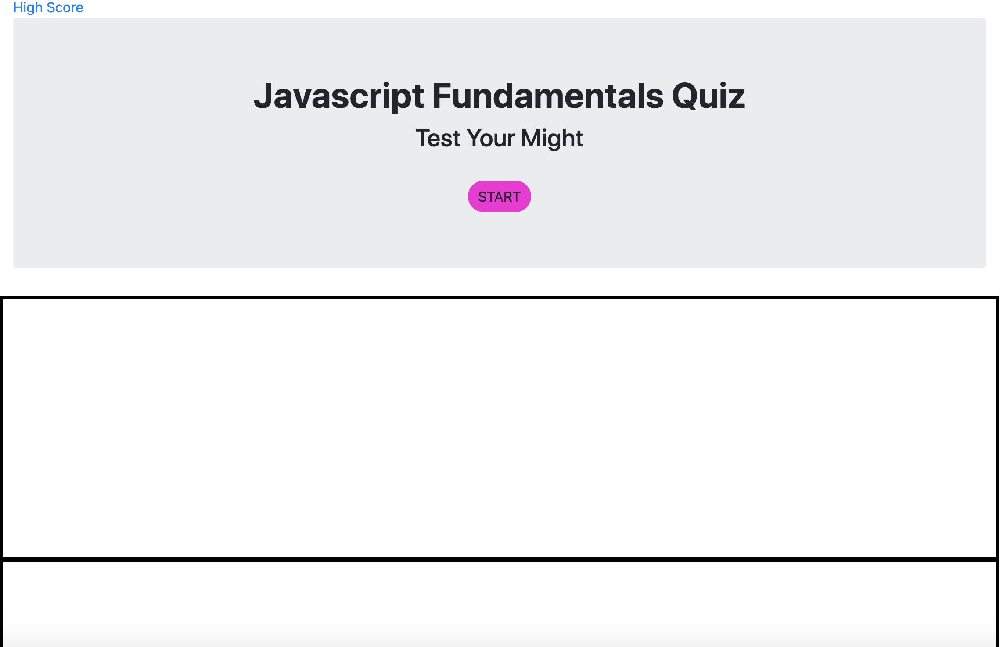

# jsfundamentalsquiz

This quiz was designed to to one's basic knowledge of certain aspects of the Javascript programming language. It was designed to be answered within 100 seconds, with each incorrect answer subtracting 10 seconds from the overall time.

This project was recently updated and is now capable of storing user scores. Additional issues with the timer were also fixed.

[Javascript Fundamentals Quiz](https://cynesthete.github.io/jsfundamentalsquiz/) is hosted on GitHub pages.

This application was authored by [Tony Rivas](https://cynesthete.github.io).

Author's note: advice and mentorship from Bobbi Tarkany was essential in the creation of this application. I would like to humbly thank her for the advice and guidance in coding and debugging this application. She helped me push and articulate what I had learned in order to make this work properly.